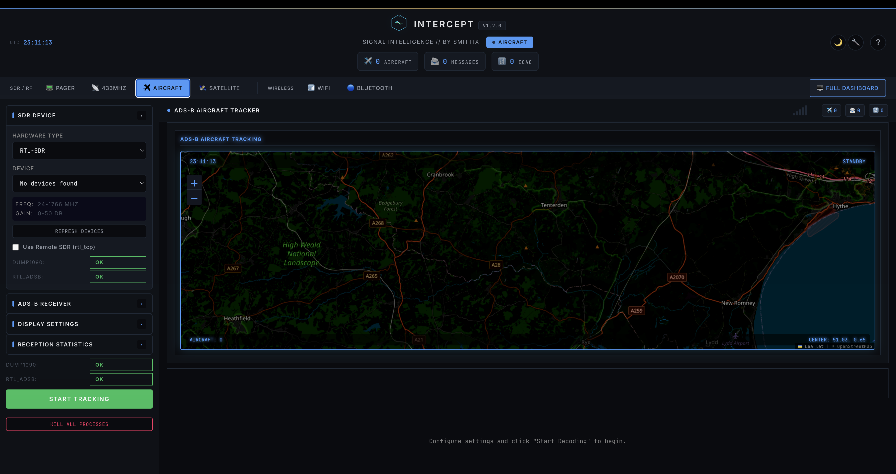

# INTERCEPT

<p align="center">
  
  
  
</p>

<p align="center">
  <strong>Signal Intelligence Platform</strong><br>
  A web-based interface for software-defined radio tools.
</p>

<p align="center">
  
</p>

---

## Features

- **Pager Decoding** - POCSAG/FLEX via rtl_fm + multimon-ng
- **433MHz Sensors** - Weather stations, TPMS, IoT devices via rtl_433
- **Aircraft Tracking** - ADS-B via dump1090 with real-time map and radar
- **Listening Post** - Frequency scanner with audio monitoring
- **Satellite Tracking** - Pass prediction using TLE data
- **WiFi Scanning** - Monitor mode reconnaissance via aircrack-ng
- **Bluetooth Scanning** - Device discovery and tracker detection

---

## Installation

### macOS

**1. Install Homebrew** (if not already installed):
```bash
/bin/bash -c "$(curl -fsSL https://raw.githubusercontent.com/Homebrew/install/HEAD/install.sh)"
```

**2. Install dependencies:**
```bash
# Required
brew install python@3.11 librtlsdr multimon-ng rtl_433 sox

# For ADS-B aircraft tracking
brew install dump1090-mutability

# For WiFi scanning (optional)
brew install aircrack-ng
```

**3. Clone and run:**
```bash
git clone https://github.com/smittix/intercept.git
cd intercept
./setup.sh
sudo python3 intercept.py
```

### Debian / Ubuntu / Raspberry Pi OS

**1. Install dependencies:**
```bash
sudo apt update
sudo apt install -y python3 python3-pip python3-venv git

# Required SDR tools
sudo apt install -y rtl-sdr multimon-ng rtl-433 sox

# For ADS-B aircraft tracking (package name varies)
sudo apt install -y dump1090-mutability  # or dump1090-fa

# For WiFi scanning (optional)
sudo apt install -y aircrack-ng

# For Bluetooth scanning (optional)
sudo apt install -y bluez bluetooth
```

**2. Clone and run:**
```bash
git clone https://github.com/smittix/intercept.git
cd intercept
./setup.sh
sudo python3 intercept.py
```

> **Note:** On Raspberry Pi or headless systems, you may need to run `sudo venv/bin/python intercept.py` if a virtual environment was created.

### Docker (Alternative)

```bash
git clone https://github.com/smittix/intercept.git
cd intercept
docker-compose up -d
```

> **Note:** Docker requires privileged mode for USB SDR access. See `docker-compose.yml` for configuration options.

### Open the Interface

After starting, open **http://localhost:5050** in your browser.

---

## Hardware Requirements

| Hardware | Purpose | Price |
|----------|---------|-------|
| **RTL-SDR** | Required for all SDR features | ~$25-35 |
| **WiFi adapter** | Monitor mode scanning (optional) | ~$20-40 |
| **Bluetooth adapter** | Device scanning (usually built-in) | - |

Most features work with a basic RTL-SDR dongle (RTL2832U + R820T2).

---

## Troubleshooting

### RTL-SDR not detected (Linux)

Add udev rules:
```bash
sudo bash -c 'cat > /etc/udev/rules.d/20-rtlsdr.rules << EOF
SUBSYSTEM=="usb", ATTRS{idVendor}=="0bda", ATTRS{idProduct}=="2838", MODE="0666"
SUBSYSTEM=="usb", ATTRS{idVendor}=="0bda", ATTRS{idProduct}=="2832", MODE="0666"
EOF'
sudo udevadm control --reload-rules && sudo udevadm trigger
```
Then unplug and replug your RTL-SDR.

### "externally-managed-environment" error (Ubuntu 23.04+)

The setup script handles this automatically by creating a virtual environment. Run:
```bash
./setup.sh
source venv/bin/activate
sudo venv/bin/python intercept.py
```

### dump1090 not available (Debian Trixie)

On newer Debian versions, dump1090 may not be in repositories. Install from FlightAware:
- https://flightaware.com/adsb/piaware/install

### Verify installation

```bash
python3 intercept.py --check-deps
```

---

## Community

<p align="center">
  <a href="https://discord.gg/z3g3NJMe">Join our Discord</a>
</p>

---

## Documentation

- [Usage Guide](docs/USAGE.md) - Detailed instructions for each mode
- [Hardware Guide](docs/HARDWARE.md) - SDR hardware and advanced setup
- [Troubleshooting](docs/TROUBLESHOOTING.md) - Common issues and solutions

---

## Disclaimer

**This software is for educational and authorized testing purposes only.**

- Only use with proper authorization
- Intercepting communications without consent may be illegal
- You are responsible for compliance with applicable laws

---

## License

MIT License - see [LICENSE](LICENSE)

## Author

Created by **smittix** - [GitHub](https://github.com/smittix)

## Acknowledgments

[rtl-sdr](https://osmocom.org/projects/rtl-sdr/wiki) |
[multimon-ng](https://github.com/EliasOenal/multimon-ng) |
[rtl_433](https://github.com/merbanan/rtl_433) |
[dump1090](https://github.com/flightaware/dump1090) |
[aircrack-ng](https://www.aircrack-ng.org/) |
[Leaflet.js](https://leafletjs.com/) |
[Celestrak](https://celestrak.org/)
